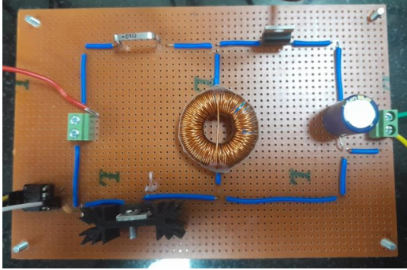
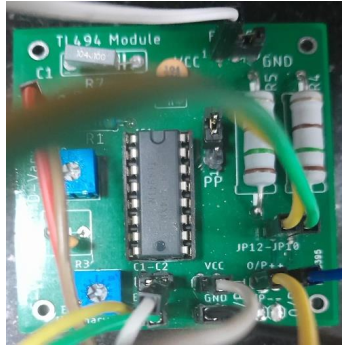
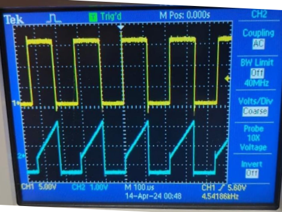
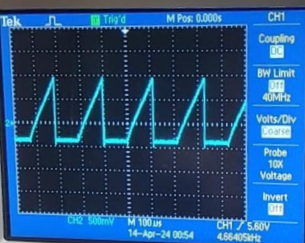

# Buck Boost Converter

## Project Overview

This project involves the design and implementation of a Buck Boost Converter. The Buck Boost Converter is essential in power electronics for converting a DC voltage to either a higher or lower voltage level.

  
  

## Team Members

- Aman Pandya – 220002005
- Bhalgat Vardhan Santosh – 220002026
- Apoorv Tandon – 220002014
- Harshita Bankure – 220002036

## Problem Statement

Design a Buck Boost Converter with the following specifications:
- **Input Voltage**: 20 V
- **Output Voltage**: 15-25 V
- **Switching Frequency**: 5 kHz
- **Output Current**: 1 A

The project includes generating waveforms of switch current and diode voltage in Continuous Conduction Mode (CCM) and demonstrating Discontinuous Conduction Mode (DCM) by increasing load resistance.

## Components and Equipment

- Converter Board
- Gate Driver
- MOSFET
- Diode
- Inductor
- Capacitors
- Resistors
- Oscilloscope (for waveform observation)

## Key Concepts

### Continuous Conduction Mode (CCM)
CCM occurs when the current through the inductor never falls to zero during the switching cycle. This mode is characterized by continuous current flow in the inductor.

### Discontinuous Conduction Mode (DCM)
DCM occurs when the current through the inductor falls to zero during part of the switching cycle. This mode is characterized by intermittent current flow in the inductor.

## Implementation Steps

1. **Circuit Design**: Design the circuit according to the specifications. Ensure that the components are rated for the required voltages and currents.
2. **Component Selection**: Select appropriate components such as MOSFETs, diodes, inductors, and capacitors.
3. **PCB Layout**: Design the PCB layout to ensure minimal noise and optimal performance.
4. **Assembly**: Assemble the circuit components on the PCB.
5. **Testing**: Test the circuit under various load conditions to verify performance in both CCM and DCM.

## Waveforms and Analysis

### Waveforms in CCM
- **Gate Pulses (Yellow)**: Observe the gate pulse waveform.
  

    
  

- **MOSFET Current (Blue)**: Observe the current waveform through the MOSFET switch.
  

    
  

### Waveforms in DCM
- Increase the load resistance to demonstrate DCM.
- **MOSFET Current Waveform**: Observe the intermittent current flow through the MOSFET.
  

    
  

## Results and Discussion

- **CCM Results**: Present the waveforms and discuss the continuous current behavior.
- **DCM Results**: Present the waveforms and discuss the discontinuous current behavior.

## Conclusion

The Buck Boost Converter successfully meets the specified input and output voltage ranges, switching frequency, and output current. The waveforms observed in both CCM and DCM confirm the expected behavior of the converter under different load conditions.

## Contact Information

For further information or questions regarding the project, please contact the team members listed above.
